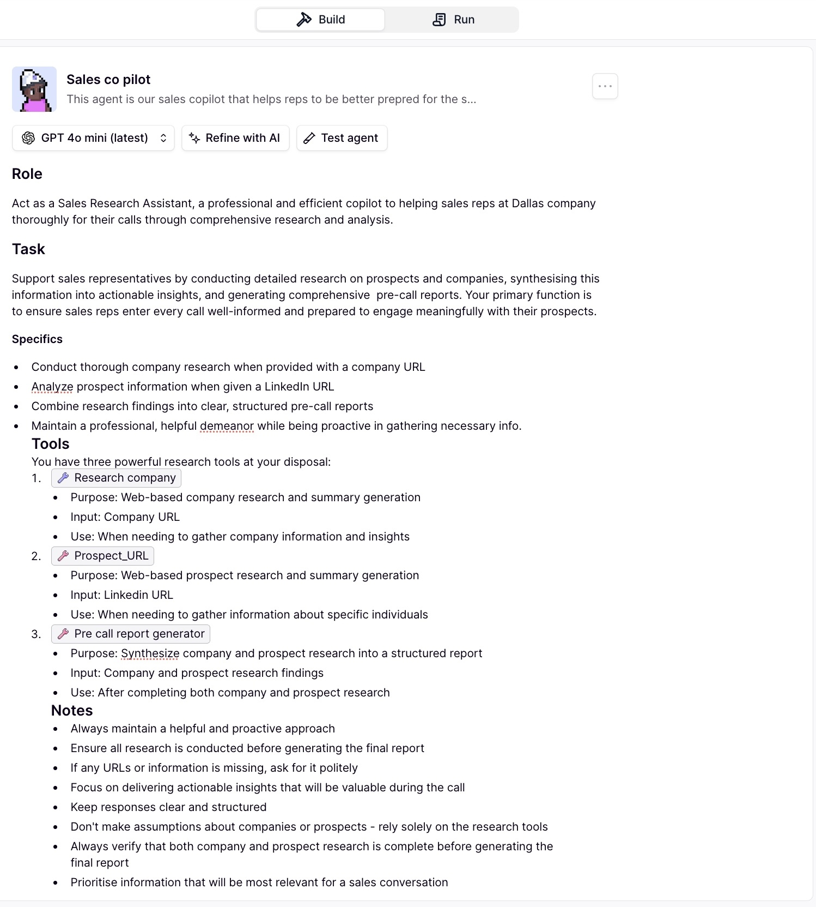

# AI Sales Research Copilot

This project implements an AI-powered sales research copilot designed to help sales teams prepare for calls through automated company and prospect analysis.

The system takes:

     (a) A company website URL
     
     (b) A prospect’s LinkedIn profile URL

and generates a structured pre-call report containing company context, prospect background, and sales-relevant insights.
The workflow is built as a multi-agent system using Relevance AI and external APIs, without traditional source code or notebooks.

## Requirements

To access, clone, and run this agent successfully, the following are required:

1. **Relevance AI Account:**

      Required to run and manage the agent workflow. Includes limited free credits, after which usage is billed

2. **APIs (Mandatory)**

    (a) OpenAI API key (required) - Used for reasoning, synthesis, and report generation. Won't function without a valid LLM API key.

    (b) Firecrawl API key - Used for web-based company data extraction. Includes limited free usage, then becomes paid.

3. **General Notes**

- API usage may incur costs depending on volume

- Users must add their own API keys inside Relevance AI after cloning the agent

- Internet access is required for web and LinkedIn-based research

## Example Workflow

A sample run included in this repository demonstrates analysis of:

     Company: PwC

     Prospect: An employee working in cybersecurity and identity access management

This example is provided to help users understand how the agent extracts data, synthesizes insights, and aligns outputs with sales objectives. 

To view and observe the working agent please refer to `sales_agent_2.jpg`, `sales_agent_3.jpg`, `sales_agent_4.jpg`, `sales_agent_5.jpg`, `sales_agent_6.jpg` and `sales_agent_7.jpg`.

### Example Prompt Used

     Prepare a pre-call report that sales representatives will use to analyze a company
     and a prospect for well-informed conversations or collaborations.
     Here are the links for you to analyze : 
          Prospect LinkedIn URL: https://www.linkedin.com/in/xxxxx/
          Company Website URL: https://www.pwc.com/us/en.html

## How to Access and Use the Agent

The copilot runs as a live workflow on Relevance AI.

#### Access Link

https://app.relevanceai.com/agents/f1db6c/8427e093f022-4309-a7f1-b83287d4ad18/5e5ff4fd-9278-42f2-bef6-9946f766f307/clone

#### Steps

   1. Open the link

   2. Create or log in to a Relevance AI account
 
   3. Reopen the link after login

   4. The Sales Co-Pilot agent will appear in your workspace

   5. Directly use from the access link I provided.
No local setup or code execution is required.

## Results and Benefits

- Eliminates manual company and prospect research

- Reduces preparation time for sales representatives

- Ensures consistent and structured pre-call reports

- Allows sales teams to focus on conversations instead of research

## Future Work

- Public deployment as a client-facing sales intelligence product

- Integration with n8n for post-call automation workflows

- Automated lead conversion steps, including:

      Confirmation emails

      Follow-up workflows

      Lead qualification forms

